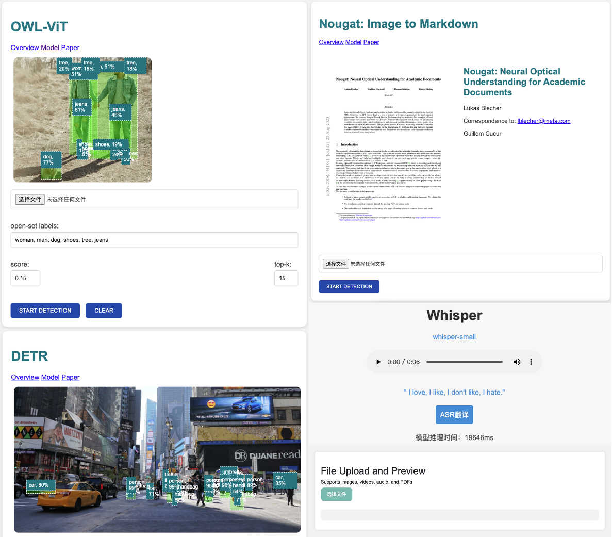

# ai.js
Based on the @xenova/transformers and @mediapipe/tasks-vision libraries, this project implements on-browser JavaScript-based tasks including vision tasks such as open/closed-set object detection and speech translation.
